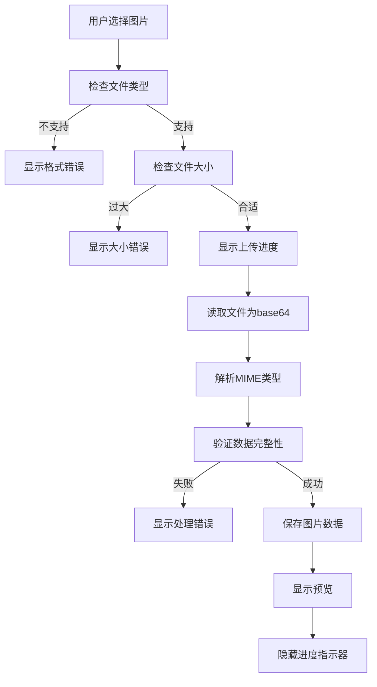

# 前端图片上传格式转换与格式检查实现说明

## 🎯 实现目标

- **确保上传图片格式正确**，避免 Gemini API 400 错误
- **前端自动识别与校验**图片类型、大小、编码方式
- **优化用户体验**，提供实时反馈和错误提示

## 🔧 核心功能实现

### 1. 图片格式检查与限制

```javascript
// 支持的图片类型
this.allowedTypes = ['image/png', 'image/jpeg', 'image/jpg'];
// 最大文件大小 (4MB)
this.maxFileSize = 4 * 1024 * 1024;
```

**检查流程：**
- ✅ 文件类型验证（仅允许 PNG/JPEG）
- ✅ 文件大小验证（最大 4MB）
- ✅ 实时错误提示，多语言支持

### 2. 图片数据处理与转换

```javascript
// 标准化的图片数据结构
{
  mime_type: "image/png",    // 标准化的MIME类型
  data: "base64编码内容"      // 纯base64数据（不含前缀）
}
```

**处理特性：**
- 🔄 自动标准化 MIME 类型（image/jpg → image/jpeg）
- 📊 严格的 base64 数据验证
- 🛡️ 错误处理与异常捕获

### 3. 发送格式 - Gemini API 兼容

```javascript
// 发送到后端的请求体格式
{
  "prompt": "什么是机器学习？",
  "num_images": 3,
  "animal": "rabbit",
  "image": {
    "mime_type": "image/png",
    "data": "iVBORw0KGgoAAAANSUhEUgAA..."
  }
}
```

## 🎨 用户体验优化

### 1. 视觉反馈
- **上传进度动画**：处理图片时显示脉冲动画
- **错误提示动画**：错误消息滑入效果
- **图片预览增强**：悬停阴影效果

### 2. 错误处理
- **实时验证**：文件选择时立即检查格式和大小
- **多语言错误消息**：支持中文、英文、日文、韩文
- **自动隐藏**：错误消息 3 秒后自动消失

### 3. 交互优化
- **一键清除**：快速移除已上传图片
- **状态同步**：上传状态与UI状态保持一致
- **防重复提交**：处理过程中禁用重复操作

## 📝 错误消息多语言支持

### 中文 (zh)
- 无效格式：`"仅支持 PNG 或 JPEG 图片格式"`
- 文件过大：`"图片过大，最大支持 4MB"`
- 处理失败：`"图片处理失败，请重试"`
- 无输入：`"请输入文本或上传图片"`

### 英文 (en)
- 无效格式：`"Only PNG or JPEG image formats are supported"`
- 文件过大：`"Image too large, maximum 4MB supported"`
- 处理失败：`"Image processing failed, please try again"`
- 无输入：`"Please enter text or upload an image"`

### 日文 (ja)
- 无效格式：`"PNG または JPEG 画像フォーマットのみサポートされています"`
- 文件过大：`"画像が大きすぎます。最大4MBまでサポートされています"`
- 处理失败：`"画像処理に失敗しました。もう一度お試しください"`
- 无输入：`"テキストを入力するか画像をアップロードしてください"`

### 韩文 (ko)
- 无效格式：`"PNG 또는 JPEG 이미지 형식만 지원됩니다"`
- 文件过大：`"이미지가 너무 큽니다. 최대 4MB까지 지원됩니다"`
- 处理失败：`"이미지 처리에 실패했습니다. 다시 시도해주세요"`
- 无输入：`"텍스트를 입력하거나 이미지를 업로드해주세요"`

## 🔄 完整处理流程



## 🚀 技术优势

1. **完全兼容 Gemini API**：确保图片数据格式完全符合要求
2. **前端预验证**：减少无效请求，提升后端性能
3. **用户友好**：清晰的错误提示和视觉反馈
4. **国际化**：完整的多语言支持
5. **健壮性**：全面的错误处理和异常捕获

## 🔧 后端兼容性

后端无需额外处理图片格式，可直接转发给 Gemini API：

```javascript
// 后端可以直接使用前端发送的格式
const imageData = request.image; // { mime_type, data }
// 直接传给 Gemini API，无需格式转换
```

## 📋 测试清单

- ✅ PNG 图片上传
- ✅ JPEG 图片上传  
- ✅ JPG 图片上传（自动转换为 image/jpeg）
- ✅ 不支持格式拒绝（如 GIF、WebP）
- ✅ 超大文件拒绝
- ✅ 错误消息多语言显示
- ✅ 上传进度显示
- ✅ 图片预览功能
- ✅ 一键移除功能
- ✅ 提交时格式验证

## 🎉 结论

通过这套完整的前端图片处理方案，可以有效避免因图片格式问题导致的 Gemini API 400 错误，同时提供优秀的用户体验和完善的国际化支持。
