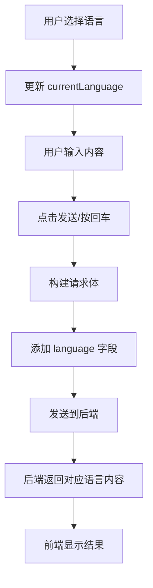

# 多语言API集成实现说明

## 🎯 实现目标

- **自动语言检测**: 前端自动发送当前用户选择的语言
- **后端多语言响应**: 后端根据语言参数返回对应语言的内容
- **无缝切换**: 用户切换语言后，新请求自动使用新语言

## 🔧 前端实现

### 1. 请求体格式

```javascript
const body = {
  num_images: parseInt(this.elements.numImagesSelect.value),
  animal: this.elements.animalTypeSelect.value,
  language: this.currentLanguage, // 核心：当前语言设置
  prompt: "用户输入的内容",
  image: { // 可选
    mime_type: "image/png",
    data: "base64数据"
  }
};
```

### 2. 语言代码映射

| 前端语言代码 | 语言名称 | 后端预期响应 |
|-------------|----------|-------------|
| `zh` | 中文 | 中文解释和描述 |
| `en` | English | English explanations |
| `ja` | 日本語 | 日本語での説明 |
| `ko` | 한국어 | 한국어 설명 |

### 3. 完整请求示例

#### 中文请求
```json
{
  "prompt": "什么是机器学习？",
  "num_images": 2,
  "animal": "cat",
  "language": "zh"
}
```

#### 英文请求
```json
{
  "prompt": "What is machine learning?",
  "num_images": 2, 
  "animal": "cat",
  "language": "en"
}
```

#### 日文请求
```json
{
  "prompt": "機械学習とは何ですか？",
  "num_images": 2,
  "animal": "cat", 
  "language": "ja"
}
```

#### 韩文请求
```json
{
  "prompt": "머신러닝이 무엇인가요？",
  "num_images": 2,
  "animal": "cat",
  "language": "ko"
}
```

## 🔄 工作流程

### 1. 用户交互流程


### 2. 语言切换场景
1. **页面加载**: 使用 localStorage 保存的语言或默认中文
2. **用户切换**: 立即更新 `currentLanguage` 并保存到 localStorage
3. **下次请求**: 自动使用新语言设置

### 3. 代码实现关键点

```javascript
// 语言切换时更新
changeLanguage(lang) {
  this.currentLanguage = lang;
  localStorage.setItem('language', lang);
  this.updateUI();
}

// 提交时自动包含语言
async submitPrompt() {
  // ...验证逻辑...
  
  const body = {
    num_images: parseInt(this.elements.numImagesSelect.value),
    animal: this.elements.animalTypeSelect.value,
    language: this.currentLanguage // 自动添加当前语言
  };
  
  // ...其他逻辑...
}
```

## 🎨 用户体验优化

### 1. 语言一致性
- **UI语言**: 前端界面使用选择的语言
- **API语言**: 后端响应使用相同语言
- **示例更新**: 切换语言时示例也自动更新

### 2. 智能提示
- 不同语言的输入提示符合语言习惯
- 错误消息使用对应语言显示
- 加载消息也会本地化

### 3. 记忆功能
- 用户语言偏好自动保存
- 下次访问自动恢复语言设置
- 跨会话保持语言一致性

## 🔧 后端集成建议

### 1. 语言检测
```javascript
// 后端处理语言参数
const { language, prompt, num_images, animal, image } = request.body;

// 根据语言设置生成提示词
const systemPrompt = getSystemPrompt(language, animal);
const userPrompt = getLocalizedPrompt(prompt, language);
```

### 2. 多语言内容生成
- **系统提示**: 用对应语言告诉AI如何回复
- **用户内容**: 如果需要，翻译用户输入
- **响应验证**: 确保AI回复使用正确语言

### 3. 错误处理
```javascript
// 多语言错误消息
const errorMessages = {
  zh: "生成失败，请重试",
  en: "Generation failed, please try again", 
  ja: "生成に失敗しました。もう一度お試しください",
  ko: "생성에 실패했습니다. 다시 시도해주세요"
};
```

## 📋 测试清单

- ✅ 中文输入 → 中文响应
- ✅ 英文输入 → 英文响应  
- ✅ 日文输入 → 日文响应
- ✅ 韩文输入 → 韩文响应
- ✅ 语言切换后新请求使用新语言
- ✅ 语言偏好正确保存和恢复
- ✅ 多语言错误处理
- ✅ 混合内容处理（图片+文字）

## 🎉 实现效果

这个多语言API集成实现了：

1. **无缝语言体验**: 前后端语言完全一致
2. **智能语言检测**: 自动发送当前语言设置  
3. **用户友好**: 语言切换立即生效
4. **开发友好**: 后端可以轻松处理多语言逻辑

用户现在可以选择任何支持的语言，后端将返回相应语言的解释内容，提供真正的多语言用户体验！
