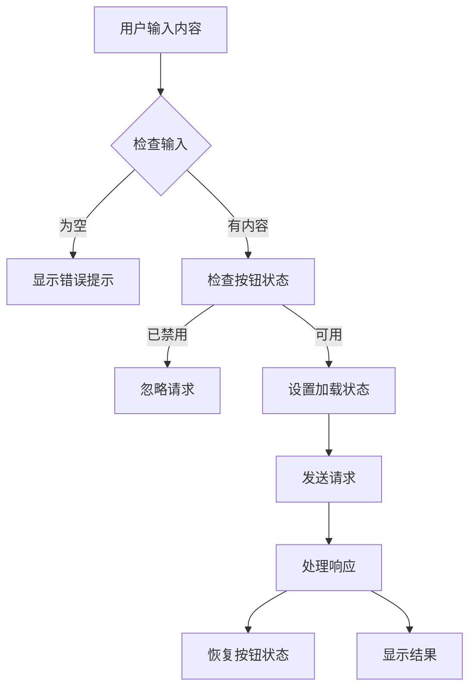

# 发送按钮功能实现说明

## 🎯 功能目标

- **防止重复提交**: 发送中禁用按钮，避免用户多次点击
- **视觉反馈**: 清晰的加载状态和按钮动画
- **多样化交互**: 支持按钮点击和回车键提交
- **国际化支持**: 多语言按钮文本

## 🔧 核心功能实现

### 1. 按钮设计

```html
<button id="send-btn" class="send-btn">
  <!-- 发送图标 -->
  <svg class="send-icon">...</svg>
  
  <!-- 加载图标 -->
  <svg class="loading-icon" style="display: none;">...</svg>
  
  <!-- 按钮文本 -->
  <span class="send-text">发送</span>
</button>
```

**设计特色:**
- 🎨 **圆形渐变按钮**: 现代化的视觉设计
- 🔄 **双图标系统**: 发送图标 ↔ 加载动画
- 📱 **响应式适配**: 桌面端显示图标，移动端显示文字
- ✨ **悬停效果**: 平滑的阴影和位移动画

### 2. 状态管理

```javascript
// 设置按钮状态
setSendButtonState(isLoading) {
  if (isLoading) {
    // 禁用按钮，显示加载状态
    this.elements.sendBtn.disabled = true;
    this.elements.sendText.textContent = t.sendingText;
    this.elements.sendIcon.style.display = 'none';
    this.elements.loadingIcon.style.display = 'block';
  } else {
    // 恢复按钮，显示正常状态
    this.elements.sendBtn.disabled = false;
    this.elements.sendText.textContent = t.sendButtonText;
    this.elements.sendIcon.style.display = 'block';
    this.elements.loadingIcon.style.display = 'none';
  }
}
```

**状态类型:**
- ✅ **正常状态**: 蓝色渐变，发送图标，可点击
- ⏳ **加载状态**: 灰色渐变，旋转动画，不可点击
- 🚫 **禁用状态**: 自动防重复提交保护

### 3. 交互方式

1. **按钮点击**: 直接点击发送按钮
2. **回车提交**: 在文本框中按 Enter 键
3. **防重复**: 发送中自动禁用所有提交方式

### 4. 多语言支持

| 语言 | 发送 | 发送中 |
|------|------|--------|
| 中文 | 发送 | 发送中... |
| 英文 | Send | Sending... |
| 日文 | 送信 | 送信中... |
| 韩文 | 전송 | 전송 중... |

## 🎨 样式特性

### 1. 桌面端样式
```css
.send-btn {
  width: 48px;
  height: 48px;
  border-radius: 50%;
  background: linear-gradient(135deg, #1c7ed6, #339af0);
  /* 显示图标，隐藏文字 */
}
```

### 2. 移动端适配
```css
@media (max-width: 768px) {
  .send-btn {
    width: auto;
    padding: 8px 16px;
    border-radius: 24px;
    /* 显示文字，隐藏图标 */
  }
}
```

### 3. 动画效果
- **悬停动画**: 上移1px + 阴影增强
- **点击反馈**: 瞬间回落 + 阴影减弱
- **加载动画**: 360度旋转循环
- **禁用样式**: 灰色渐变 + 禁用光标

## 🔄 完整交互流程



## 💡 用户体验优化

### 1. 视觉反馈
- **即时响应**: 点击立即显示加载状态
- **状态明确**: 清晰区分可用/不可用状态
- **进度提示**: 旋转动画表示处理中

### 2. 防误操作
- **重复提交保护**: 处理中自动禁用
- **输入验证**: 空内容时友好提示
- **错误恢复**: 失败后自动恢复按钮状态

### 3. 多样化交互
- **快捷键支持**: Enter 键快速提交
- **触摸友好**: 移动端大按钮设计
- **键盘导航**: 完整的无障碍支持

## 🎯 技术优势

1. **完全响应式**: 桌面端图标，移动端文字
2. **状态同步**: 按钮状态与应用状态完全同步
3. **多语言**: 完整的国际化支持
4. **用户友好**: 清晰的视觉反馈和错误处理
5. **性能优化**: 最小化DOM操作和重排

## 🔧 代码组织

- **模块化**: 状态管理独立封装
- **可维护**: 清晰的方法命名和职责分离
- **可扩展**: 易于添加新的交互方式
- **健壮性**: 完善的错误处理和边界情况

这个发送按钮实现提供了出色的用户体验，有效防止了重复提交问题，同时保持了现代化的视觉设计和完整的功能性。
